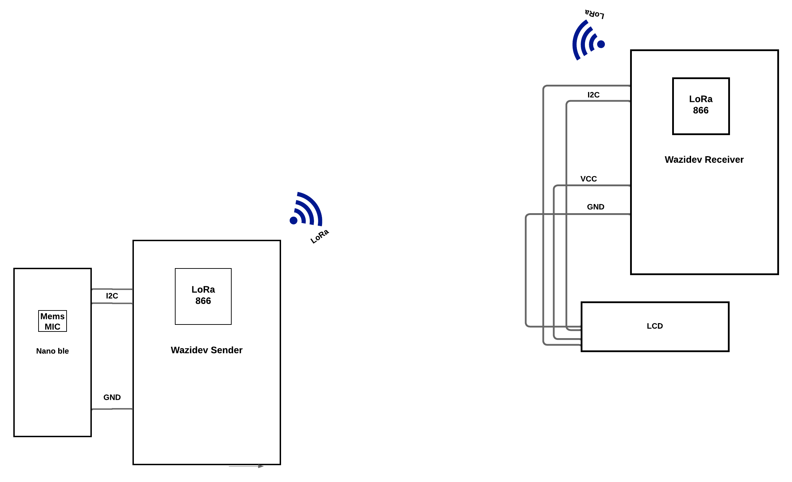

# Sound Detection Device with Arduino Nano 33 BLE Sense and Wazidev board

## OLoolua Test Overview

This Test features a sound detection system utilizing the Arduino Nano 33 BLE Sense and two Wazidev boards to transmit sound intensity data over a LoRa network. The Arduino Nano 33 BLE Sense detects sound levels using its built-in MEMS microphone, processes the data, and transmits it to a WAZIdev sender board via I2C. The sender board then relays this data to a WAZIdev receiver using LoRa communication, which displays the results on an LCD screen.

## Components

- Arduino Nano 33 BLE Sense
- 2 WAZIdev boards
- LCD display 
- Connecting wires
- Power supplies for each component

## Pin Connections

### Arduino Nano 33 BLE Sense to WAZIdev Sender (via I2C)
- **SDA (Nano 33 BLE)** to **SDA (WAZIdev)**
- **SCL (Nano 33 BLE)** to **SCL (WAZIdev)**
- **GND (Nano 33 BLE)** to **GND (WAZIdev)**
- **3.3V (Nano 33 BLE)** to **3.3V (WAZIdev)**

### WAZIdev Sender to WAZIdev Receiver (via LoRa)
- **LoRa connection** is established via onboard LoRa module in WAZIdev boards.

### WAZIdev Receiver to LCD Display
- Connect according to the LCD model used (typically via SPI or I2C).

## Setup and Testing
1. **Configuration**: Configure the Arduino and WAZIdev boards as per the code provided in this repository.
2. **Testing**: After setting up, perform a field test to check the range and effectiveness of the sound detection system. The system was tested in the Oloolua forest to measure its range and performance in an outdoor environment.

## Diagram of System Architecture

## Code

Oloolua_Test repository contains three main programs:
- `Oloolua_test_nanoble.ino`: Code for Arduino Nano 33 BLE Sense.
- `Oloolua_test_wazidev_sender.ino`: Code for the WAZIdev sender.
- `Oloolua_test_wazidev_receiver.ino`: Code for the WAZIdev receiver.

## Usage

To use this system, upload the respective codes to the Arduino Nano 33 BLE Sense and the WAZIdev boards. Power the system and start detecting sound. The receiver's LCD will display the sound level data in real-time.

## System Images

  
   

...

## Contributions

Feel free to fork this repository and contribute to enhancing this project. Possible improvements include optimizing power consumption, enhancing data transmission reliability, and extending the operational range.
