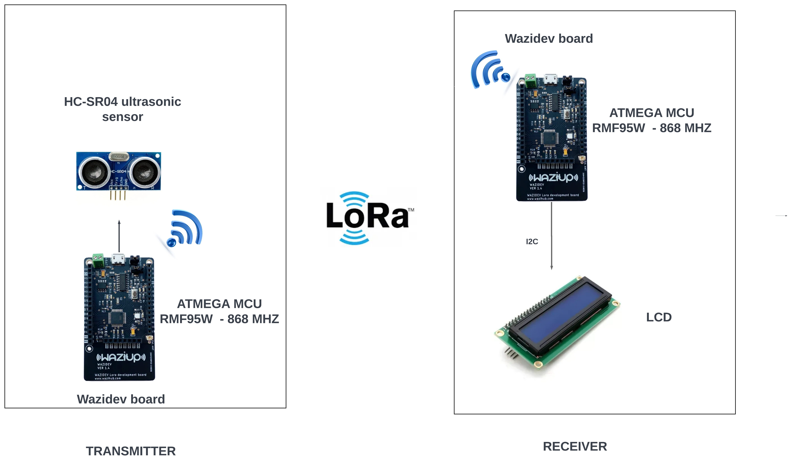

# LoRa Range Test in Oloolua Forest with Ultrasonic Sensor and WaziDev

This project is designed to perform a range test for LoRa in the Oloolua Forest using the WaziDev board and an ultrasonic sensor. The sender WaziDev board collects distance data from the ultrasonic sensor and sends it to the receiver WaziDev board. The goal is to check the viability of LoRaWAN solutions in forest environments.

## Components

- 2x WaziDev boards
- Ultrasonic sensor

## Pin Connections
###  Ultrasonic Sensor Connections
- ECHO_PIN - Connect this to digital pin 4 on your wazidev board.
- TRIG_PIN - Connect this to digital pin 5 on your wazidev  board.
### LCD I2C Connections
- SDA (Serial Data Line) - Connect this to the SDA pin on your wazidev board.
- SCL (Serial Clock Line) - Connect this to the SCL pin on your wazidev  board.

## Diagram of System Architecture

## How it Works

The sender WaziDev board is connected to an ultrasonic sensor. It collects the distance data and sends it over LoRa to the receiver WaziDev board.

The receiver WaziDev board listens for incoming LoRa packets. When a packet is received, it extracts the distance data from the packet. The received data is displayed on the Serial Monitor and an LCD.

In addition to the distance data, the receiver also displays the RSSI (Received Signal Strength Indicator) and SNR (Signal-to-Noise Ratio) of the LoRa connection. These values provide an indication of the quality of the LoRa signal, which can be used to assess the range and viability of the LoRa connection in the forest environment.

## Setup
1. Connect the ultrasonic sensor to the sender WaziDev board. Follow the sensor's documentation for the correct wiring.

2. Upload the sender code to the sender WaziDev board.

3. Connect an LCD to the receiver WaziDev board. The LCD is connected via I2C, so connect the SDA pin to the SDA pin on the WaziDev and the SCL pin to the SCL pin on the WaziDev.

4. Upload the receiver code to the receiver WaziDev board.

5. Open the Serial Monitor for both WaziDev boards. The sender should display the distance data, and the receiver should display the received distance data, RSSI, and SNR.

6. Perform the range test in the Oloolua Forest. Monitor the RSSI and SNR values to assess the quality of the LoRa signal.

## Note

Ensure the ultrasonic sensor is correctly calibrated and positioned. If the sensor is not properly set up, it may not provide accurate distance data. Also, ensure that the sensor and the WaziDev boards are powered correctly according to their specifications. Be aware that environmental factors in the forest, such as foliage and terrain, can impact the range and quality of the LoRa signal.
